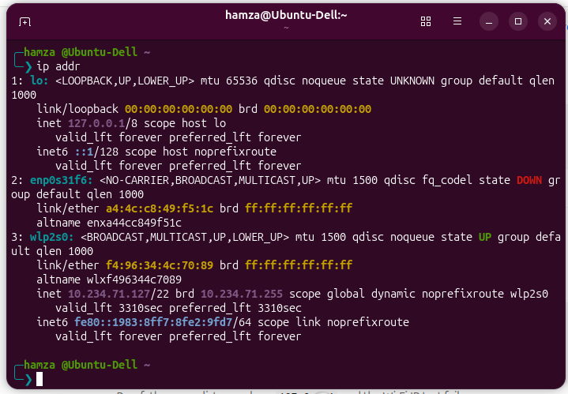
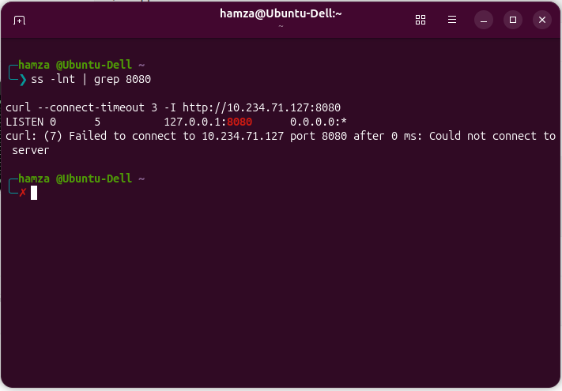
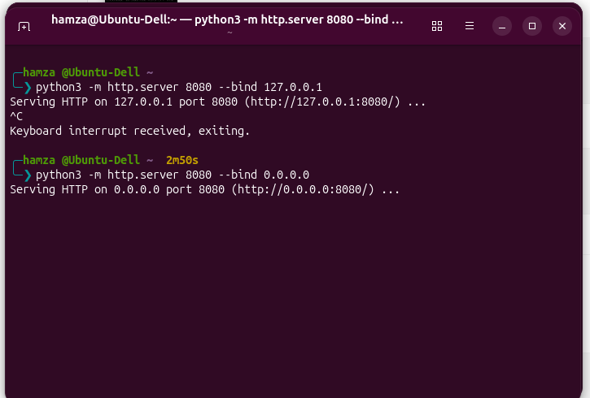
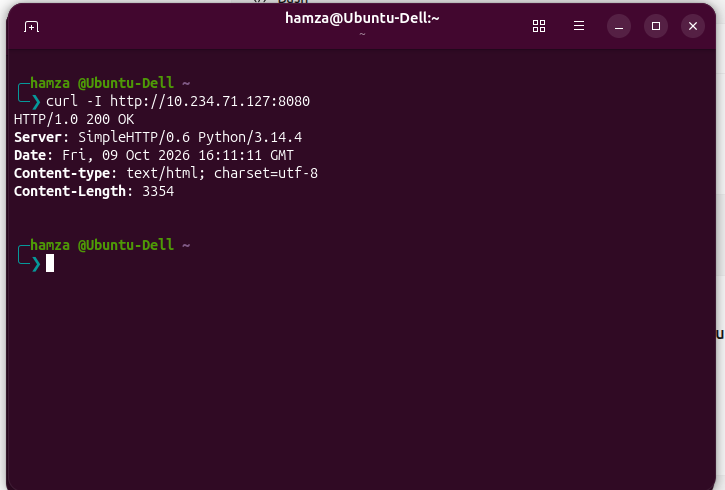

**Linux HTTP Server Troubleshooting**  
**Objective**  
Understand how network interfaces, IP addresses, TCP listening sockets, and network binding affect access to an HTTP server on Linux.  
**Environment**  
- OS: Ubuntu Linux  
- Language: Python 3  
- Protocol: HTTP over TCP  
- Test port: 8080  
**1. Inspect network interfaces**  
ip addr  
   
This command displays network interfaces and their IP addresses.  
**2. Start the server on loopback**  
python3 -m http.server 8080 --bind 127.0.0.1  
   
In another terminal, test the local connection:  
curl -I http://127.0.0.1:8080  
   
Expected result: HTTP/1.0 200 OK.  
Test the Wi-Fi IP address:  
curl --connect-timeout 3 -I http://<YOUR_WIFI_IP>:8080  
   
The connection fails because the server listens only on the loopback interface.  
**3. Inspect listening sockets**  
ss -lnt | grep 8080  
   
Expected listener:  
127.0.0.1:8080  
   
**4. Bind the server to all IPv4 interfaces**  
Stop the first server with Ctrl+C, then run:  
python3 -m http.server 8080 --bind 0.0.0.0  
   
Inspect the listener again:  
ss -lnt | grep 8080  
   
Expected listener:  
0.0.0.0:8080  
   
Test again using your current Wi-Fi IP:  
curl -I http://<YOUR_WIFI_IP>:8080  
   
Expected result: HTTP/1.0 200 OK.  
**Root Cause**  
The original server was bound exclusively to 127.0.0.1, so it accepted connections only through loopback.  
**Solution**  
Binding to 0.0.0.0 made the server listen on all local IPv4 interfaces.  
**Key Learnings**  
- ip addr displays network interfaces and IP addresses.  
- ss -lnt displays listening TCP sockets.  
- 127.0.0.1 is the loopback address.  
- 0.0.0.0 is a wildcard bind address, not the address clients should use.  
- curl can verify HTTP connectivity.  
- A listening socket alone does not guarantee that remote clients can connect; routing and firewall rules also matter.  
**Security Note**  
Binding to 0.0.0.0 can expose the server to other reachable devices. Python's development HTTP server is intended for testing, not production. Use a trusted network and stop the server when finished.  
**Verification Scope**  
The HTTP server was tested using the machine's own Wi-Fi IP. A connection from a second physical device was not verified.  
## Evidence  
   
### 1. Network interfaces  
  
   
### 2. Original loopback binding  
  
   
### 3. Listening on all IPv4 interfaces  
  
   
### 4. Successful HTTP response  
  
